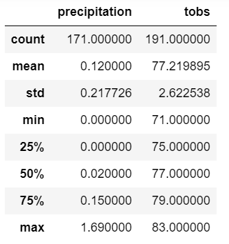
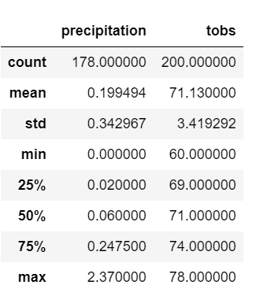
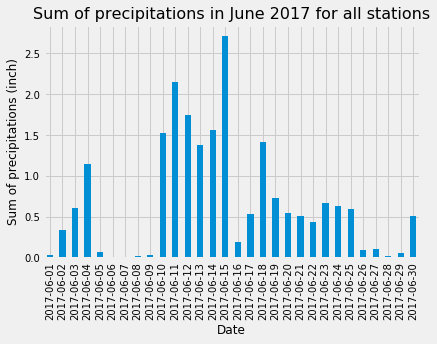
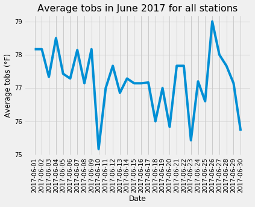
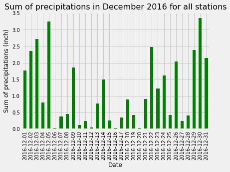
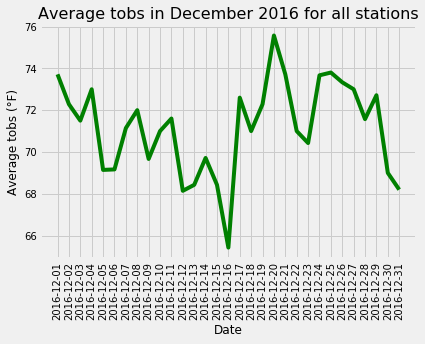
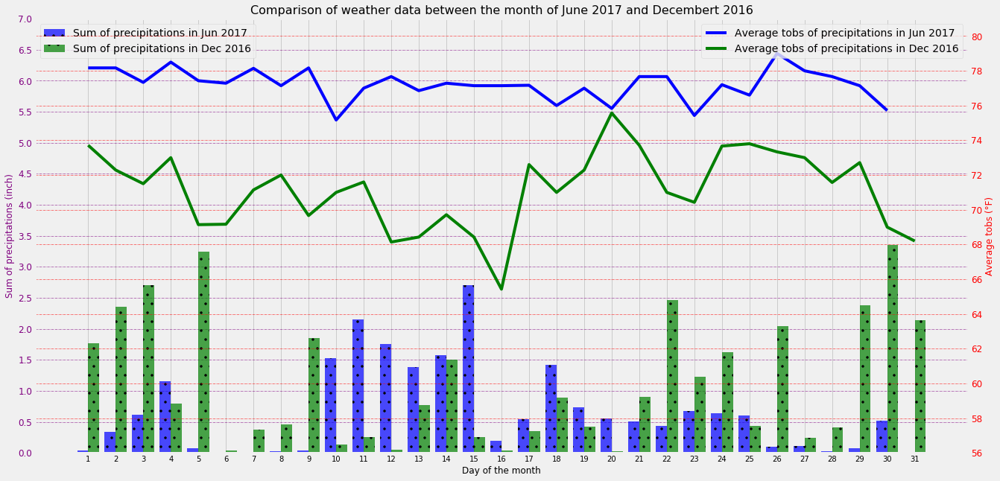

# surfs_up

## Challenge

### Objective

The goals of this challenge are for you to:

- Determine key statistical data about the month of June.
- Determine key statistical data about the month of December.
- Compare your findings between the month of June and December.
- Make 2 or 3 recommendations for further analysis.
- Share your findings in the Jupyter Notebook.

### Resources

File with code: **climate_challenge.ipynb**
SQLite database: **hawaii.sqlite** under [Data](Data/) folder

### Findings

**NB: also available in the climate_challenge.ipynb file**

#### Summary statistics for the month of June 2017

#### Summary statistics for the month of December 2016

#### Plots about June 2017 data

#### Plots about December 2016 data

#### Recap plot

#### Analysis

First, we could notice that for June 2017 and December 2016, we had about the same number of data for precipitations and tobs (about 200).

Regarding tobs:
- From the summary statistics
    - For both months, data are symmetric as mean almost tied with the median. Standard deviation is also quite low, so the temperatures are not too spread from the mean
    - The month of June was in average warmer (77°F vs. 71°F), had a superior max temperature of 83°F (vs. 78°F) and its colder day (71°) was much warmer than the one in December (60°F).

- From the comparison plot
    - The plot shows us that the month of December was indeed colder but values are in the same order

Regarding precipitations:
- From the summary statistics
    - Unlike for tobs, data are right skewed and standard deviation is very important: some days should be really rainy and other not so much for both months.
    - The month of December is, in average, almost twice as rainy as the month of June (0.20 inch vs 0.12 inch)
    - For June, we could notice also that at least 25% of measurement did not detect rain (first quartile value is 0.00 inch)
- From the comparison plot
    - The results are less explicit that the summary statistics might has let us believed:
        - In December there were 13 days with a total amount of precipitations above 1 inch. For June, only 8 days.
        - It did not rain or barely 10 days in June and only 5 days in December
        - However, it rains more in June than in December during 13 days

### Recommendation for further analysis

In order to strengthen our analysis, we would recommend to:
 - Gather the data for all years available as June 2017 might have been particularly hot and dry and December 2016 particularly cold and rainy. Thus, we could have a more accurate definition of a typical month of June and December in Oahu 
 - Then, we could sort the data and only keep the measurement for daylight or for the expected operational hours of the store (people will not surf in night and it could rain during this time) 
 - Try the refine by station location in order to the select the dryer location to implement the store